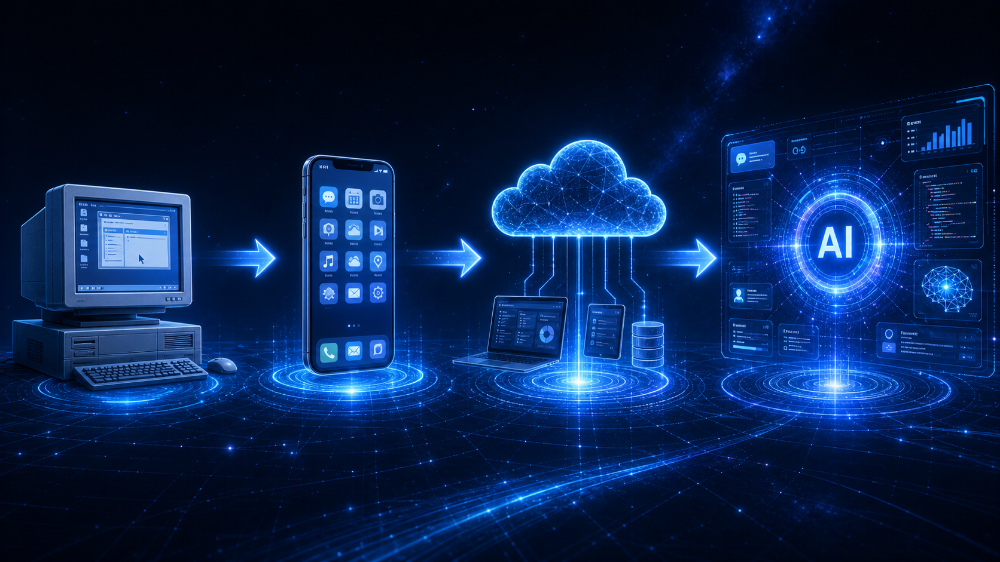
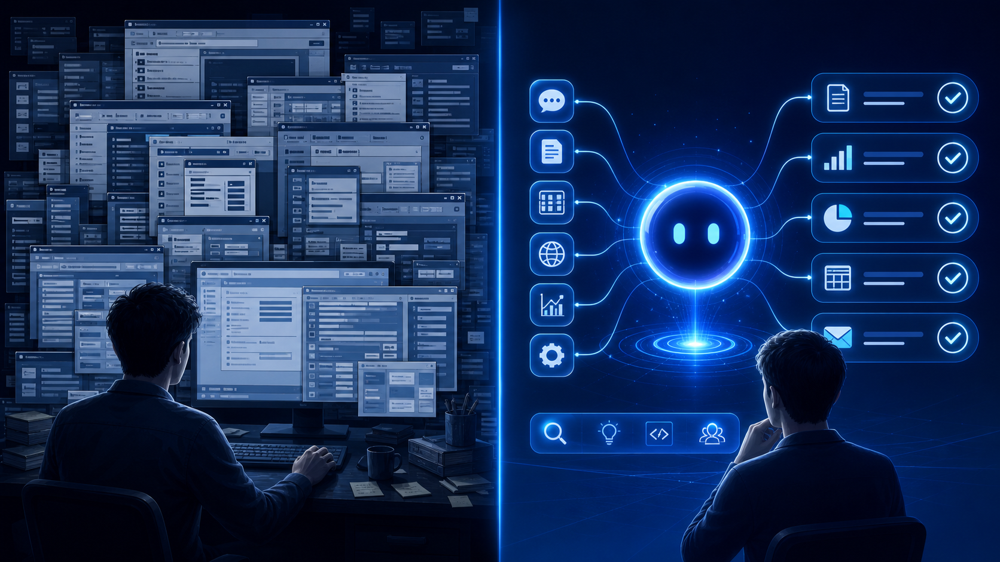
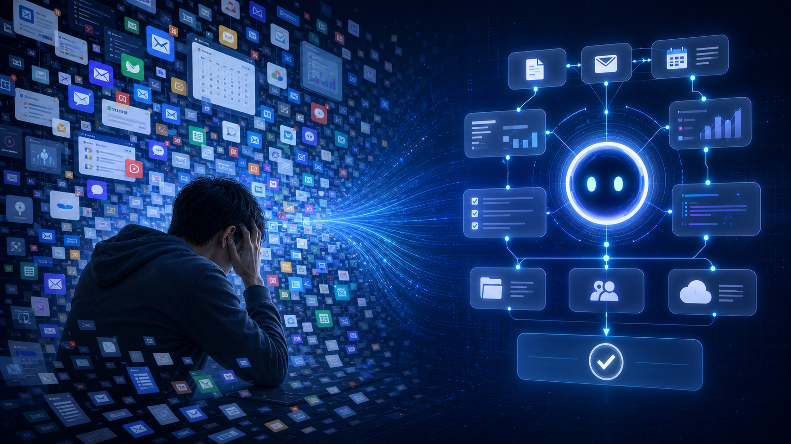
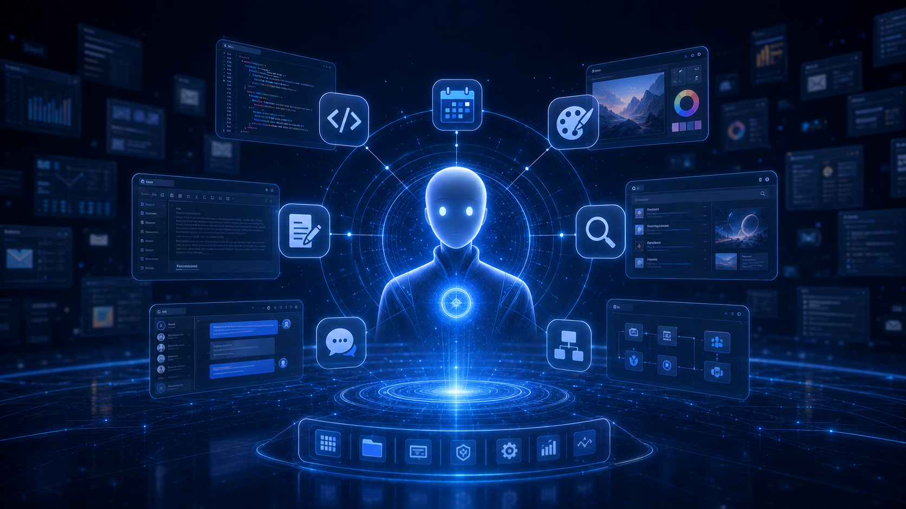

# 01 AI Native: The Software Era Has Really Changed

> Software did not suddenly become intelligent.
>
> What truly changed is this:
>
> **Software has started to understand people.**

---

When many people first hear the term **AI Native**, their first reaction is:

> Is this just another new AI buzzword?

Actually, no.

AI Native is not a marketing term.

It represents a much deeper shift:

**The relationship between software and people is being rewritten.**

For the past few decades, software has always required people to adapt to machines.

You had to learn the menus.

You had to understand the buttons.

You had to know the workflows.

You had to remember the rules.

The more familiar you were with a piece of software, the more useful it became.

But after AI appeared, this direction began to reverse.

Future software will no longer simply wait for you to operate it.

It will begin to understand what you want to accomplish.

That is the most important thing to pay attention to in AI Native.

---

## 1. Traditional Software Made People Adapt to Machines

Over the past twenty years, almost all software has followed the same pattern:

**Software provides features, and users are responsible for operating them.**

If you wanted to write a document, you opened Word.

If you wanted to make a spreadsheet, you opened Excel.

If you wanted to edit an image, you opened Photoshop.

If you wanted to book a flight, you opened a travel app.

Software did not actively understand your goal.

It simply broke its capabilities into individual features and waited for you to use them.

So traditional software was not really helping you complete a goal.

It was only providing a set of tools.

The person truly completing the work was always the user.

This is the underlying logic of traditional software:

> **People learn software, then operate software.**

---

## 2. The Core of Traditional Software Is Rules

Why did traditional software force people to learn it?

Because at its core, it was rule-driven.

Programmers defined everything in advance:

- Pages
- Buttons
- Workflows
- Conditions
- Data structures

Users could only follow these rules step by step.

Open a page.

Fill out a form.

Click submit.

Wait for the result.

If you did not know where the button was, the software would not actively help you decide.

If you did not know how the process worked, the software would not complete it on its own.

Because traditional software did not understand intent.

It only executed rules.

That is why, in the old software world, the more powerful a product became, the more complex it often became as well.

More features meant users had more to learn.

More capability meant a higher barrier to use.

This was the default assumption of the old software world:

> **Machines do not understand people, so people must understand machines.**

---

## 3. AI Changed the One Thing That Matters Most

What ChatGPT truly changed was not chatting.

Chat is only the surface.

The real breakthrough is this:

> **For the first time, software can understand human natural language and real intent at scale.**

In the past, you had to tell software:

What to do first.

What to do second.

What to do third.

Today, you can tell AI directly:

> What I want to achieve.

For example:

> Help me organize today's meeting notes.

There is no single button behind this sentence.

It contains a goal.

AI needs to understand the meeting content.

It needs to extract the key points.

It needs to organize action items.

It needs to produce a result that is easy to read.

For the first time, software is not merely executing instructions.

It is beginning to understand goals.

This is where the shift begins.

Traditional software was centered on:

**Operation**

Future software will be centered on:

**Goal**

---

## 4. AI Native Is Not App Plus AI

Many products today claim to be AI Native.

But in many cases, they are only:

> App + AI.

That means adding a chat window, an AI button, or an automatic copywriting feature to an existing piece of software.

That is certainly useful.

But it is not yet AI Native.

True AI Native is not about adding an AI feature to old software.

It is about redesigning the product around AI from the very beginning.

In this kind of product, AI is not a plugin.

AI is the brain of the system.

Memory.

Tools.

Browser.

Code.

Calendar.

Database.

All of these capabilities are organized around AI.

What the user faces is no longer a pile of features, but a system that can understand goals, call tools, and complete tasks.

In one sentence:

> **AI + App adds capability.**
>
> **AI Native redesigns software.**

---

## 5. Why the Software Era Has Really Changed

Every major shift in the software era has never been about adding a few more features.

It has always been about a change in the relationship between people and software.

In the command-line era, people had to remember commands.

In the graphical interface era, people began clicking icons.

In the mobile internet era, people operated apps through touchscreens.

In the AI Native era, people begin to express goals directly.

This means software is no longer just passively waiting for operations.

It begins to understand people.

It begins to remember context.

It begins to call tools.

It begins to complete tasks.

The role of software is changing:

From tool to assistant.

From a collection of features to a goal-execution system.

From waiting for operations to actively completing work.

That is why I say:

> **AI Native is not a product upgrade. It is a new software era.**

---

## Summary

If you can only remember one sentence, remember this:

> **In the past, people learned software.**
>
> **In the future, software will learn people.**

The software era has really changed.

In the next article, we will continue with:

> **Why AI Native is not a feature upgrade, but a new software paradigm.**
