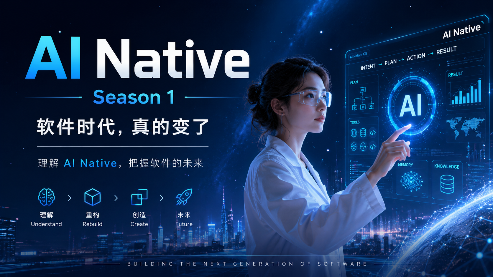
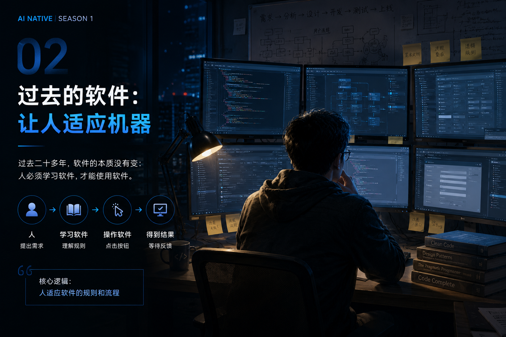
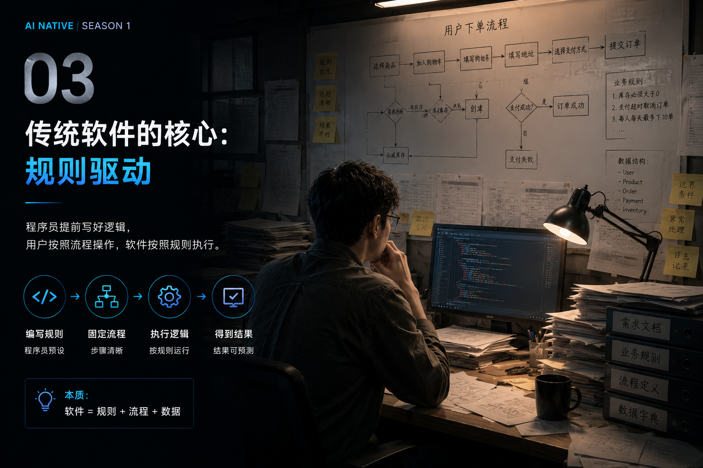
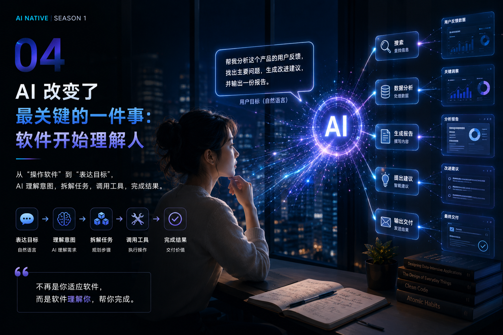
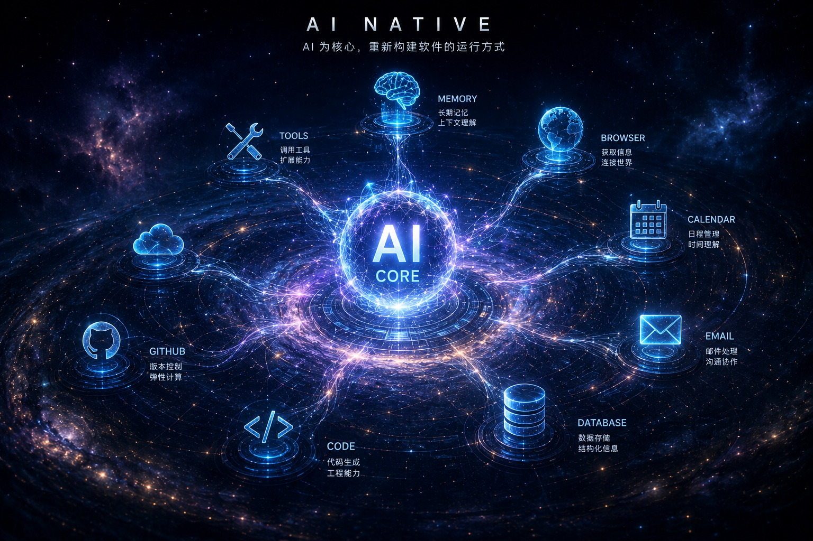
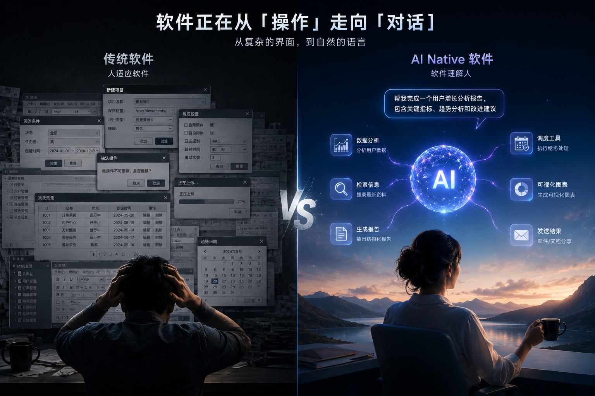
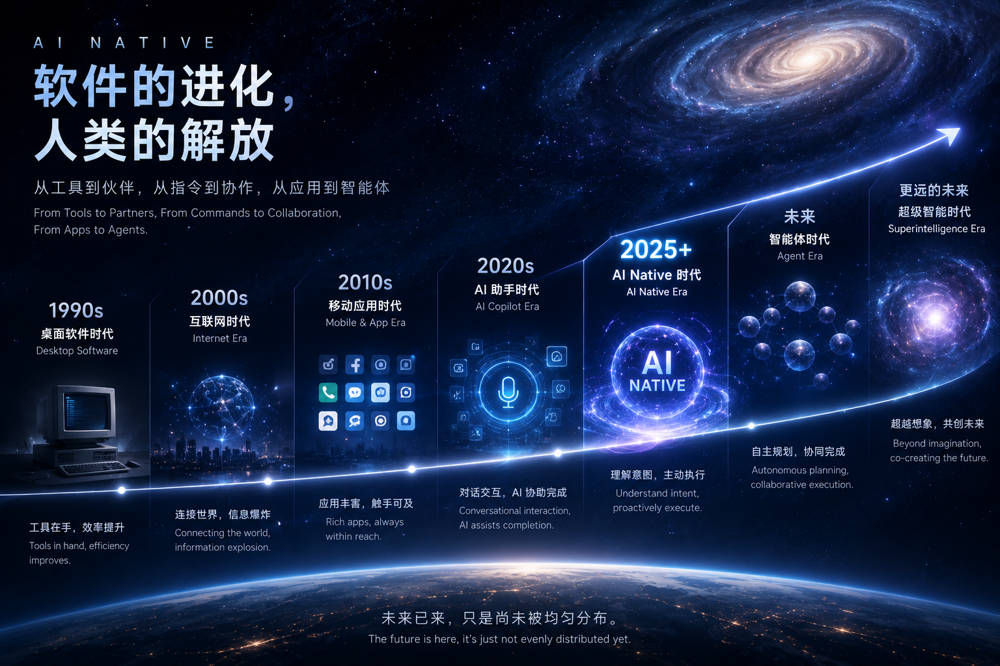

# 01 AI Native：软件时代，真的变了

> 软件没有突然变聪明。
>
> 真正变化的是：
>
> **软件开始理解人。**

---

很多人第一次听到 **AI Native**，第一反应都是：

> 又是一个新的 AI 概念？

其实不是。

AI Native 并不是一个营销词。

它代表的是：

**软件运行方式，第一次发生了根本性的变化。**

这一节，我们先不讨论定义。

先回答一个问题：

> 为什么今天的软件，越来越不像以前的软件？

---

# 一、过去的软件，是让人适应机器

过去二十多年。

几乎所有软件，都遵循同一种模式。

你需要：

学习软件。

理解规则。

按照流程操作。

最后才能得到结果。

软件不会理解你的目标。

它只会执行已经写好的流程。

所以：

> **过去的软件，本质上是规则的执行者。**

---

# 二、传统软件的核心，是规则

程序员提前写好：

- 流程
- 判断
- 按钮
- 页面
- 数据结构

用户只能：

一步一步按照软件规定操作。

例如：

打开页面。

填写表单。

点击提交。

等待结果。

整个软件运行过程中。

没有任何一步，是软件自己思考的。

因为：

> **软件不会理解需求。**

它只执行规则。

---

# 三、AI 改变了最关键的一件事

ChatGPT 真正改变的，

并不是聊天。

而是：

> **软件第一次开始理解人的意图。**

以前。

软件需要你告诉它：

第一步做什么。

第二步做什么。

第三步做什么。

今天。

你只需要告诉 AI：

> 我想得到什么。

AI 自己：

理解。

拆解。

规划。

执行。

完成。

过去的软件围绕：

**操作（Operation）**

未来的软件围绕：

**目标（Goal）**

---

# 四、什么是真正的 AI Native？

很多人觉得：

AI Native 就是：

App + ChatGPT。

其实不是。

真正的 AI Native：

不是增加 AI。

而是：

**整个产品，都围绕 AI 重新设计。**

AI 成为：

整个系统的大脑。

Memory。

Tools。

Browser。

Code。

Calendar。

Database。

全部围绕 AI 运转。

这就是：

AI Native。

---

# 五、AI Native 与 AI + App 的区别

很多产品今天都说：

自己是 AI Native。

实际上：

很多只是：

> App + AI。

AI 只是一个按钮。

一个聊天窗口。

一个插件。

真正的 AI Native。

应该是：

AI 决定：

整个产品如何运行。

如果没有 AI。

产品就无法成立。

一句话总结：

> **AI + App 是增加能力。**

> **AI Native 是重新设计软件。**

---

# 六、软件时代，真的变了

回顾过去几十年。

软件经历了几次大的变化。

PC 软件时代。

互联网时代。

移动互联网时代。

AI Copilot。

AI Native。

未来。

Agent。

甚至 Autonomous AI。

每一次变化。

都是：

人与软件关系的改变。

而 AI Native。

第一次让软件：

开始理解人。

这也是为什么。

我认为：

AI Native。

不是一次产品升级。

而是一次新的软件时代。

---

# 本节总结

如果只能记住一句话。

请记住：

> **过去，是人学习软件。**

> **未来，是软件学习人。**

软件时代。

真的变了。

下一节，我们继续讨论：

> **AI Native 为什么不是一次功能升级，而是一种新的软件范式？**