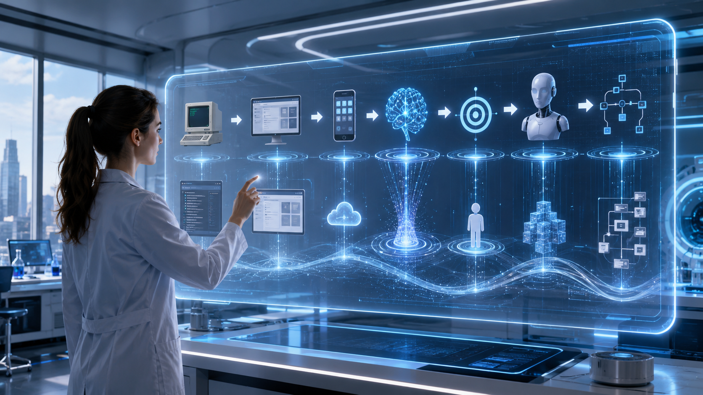
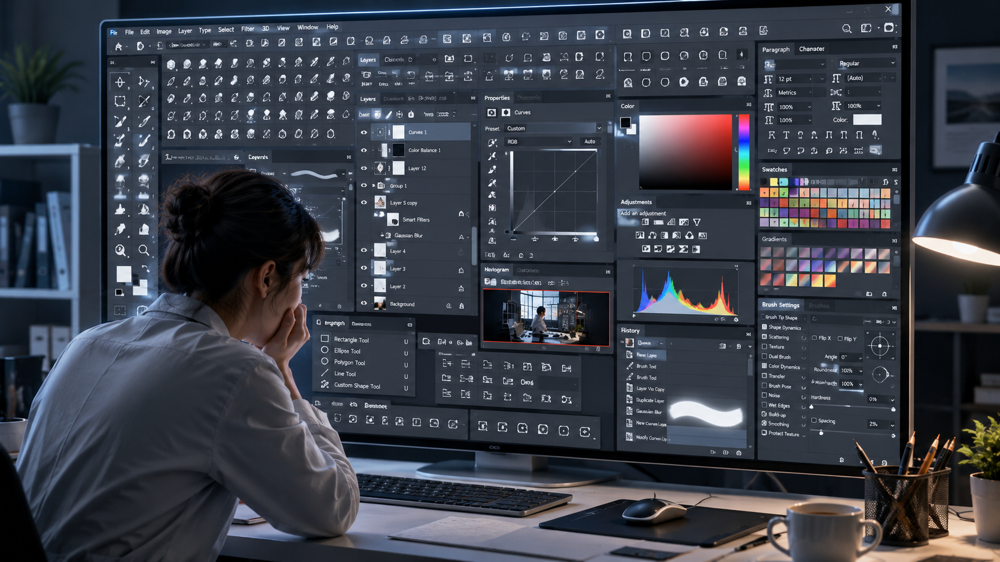
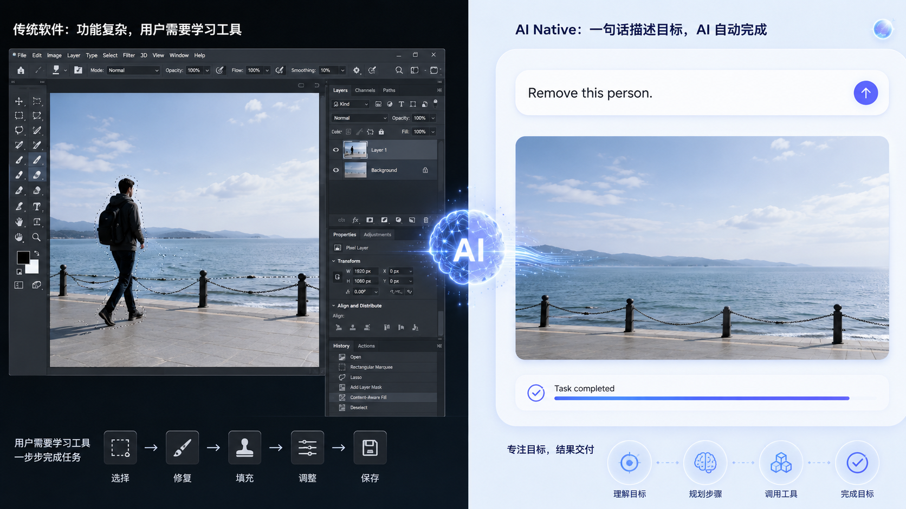
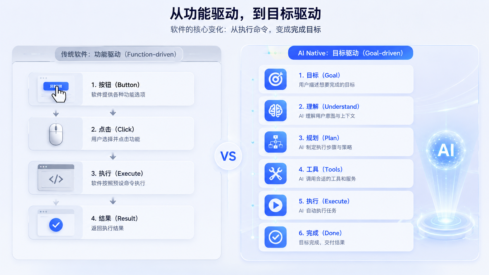
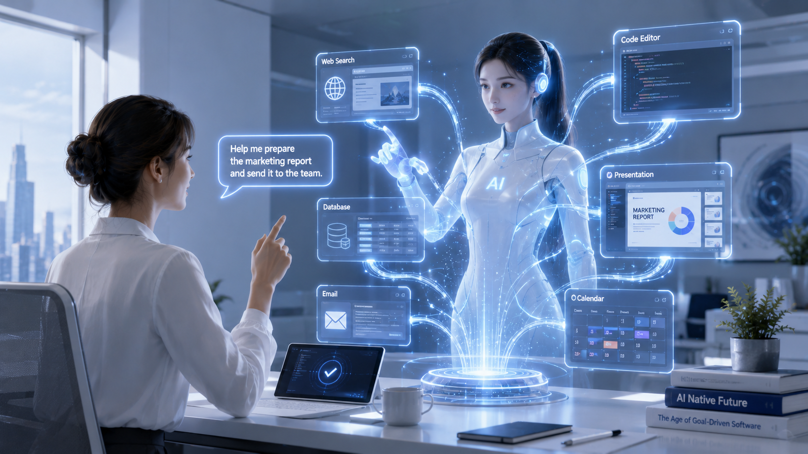

# 02 AI Native 为什么不是一次功能升级，而是一种新的软件范式？

> **未来的软件，将不再围绕“功能”设计，而是围绕“目标”设计。**

---



---

第一次看到这句话，很多人可能会觉得有些夸张。

软件不就是一个个功能组成的吗？

微信有聊天功能，Excel 有表格功能，Photoshop 有修图功能，浏览器有网页浏览功能。

过去几十年，我们几乎默认认为：

> **软件 = 功能的集合。**

于是，软件行业一直围绕一个问题不断进化：

**如何做出更多、更强、更快的功能。**

但 AI 的出现，让这个前提开始失效。

未来的软件，用户真正关心的，不再是它有什么功能，而是：

> **它能不能帮我完成目标。**

这就是 AI Native 和传统软件最大的区别。

---

## 软件一直都是围绕“功能”设计的

过去几十年，虽然软件不断升级，但底层逻辑一直没有改变。

DOS 时代，软件提供的是命令。

GUI 时代，软件提供的是按钮。

互联网时代，软件提供的是在线服务。

移动互联网时代，软件提供的是 App。

无论时代如何变化，它们都有一个共同点：

**软件把能力拆成一个个功能，等待用户主动使用。**

例如 Photoshop。

里面有数百种工具：

- 套索工具
- 钢笔工具
- 魔棒工具
- 修复画笔
- 图层蒙版

如果想完成一张图片修改，用户必须知道：

应该使用哪个工具。

应该按照什么顺序。

应该点击哪些按钮。

软件提供的是能力。

而完成工作的责任，始终属于用户。

---



---

## AI Native 改变的不是功能，而是交互方式

AI Native 最大的变化，并不是加入了聊天窗口。

而是：

**用户开始直接描述目标。**

例如过去：

> 我想把这张照片里的路人去掉。

传统软件要求你：

打开 Photoshop。

找到对应工具。

一步一步完成操作。

今天，你只需要告诉 AI：

> **把这个人去掉。**

剩下的事情，由软件完成。

它会自动判断：

- 应该调用哪个模型；
- 应该采用哪种算法；
- 是否需要补全背景；
- 是否需要优化细节。

用户甚至不知道背后调用了哪些能力。

因为真正重要的，不再是功能，而是目标。

---



---

## 软件第一次开始“理解”目标

传统软件最大的特点就是：

它不会理解你。

程序员必须提前写好所有流程。

```text
if...

else...

switch...
```

软件只能按照预设逻辑执行。

而 AI Native 不一样。

当你说：

> 帮我整理今天下午的会议内容。

软件理解的不是一句文字。

而是你的真实需求。

于是它开始自动完成：

- 提取录音；
- 语音识别；
- 总结重点；
- 整理行动项；
- 生成 Markdown；
- 同步到 Notion。

整个过程中，你没有点击任何按钮。

因为软件理解的是：

**你想完成什么。**

而不是：

**你点了什么。**

这是软件历史上第一次拥有"理解能力"。

---

## 软件第一次开始“规划”任务

理解之后，还需要决定：

下一步应该做什么。

过去的软件不会思考。

每一步都需要用户告诉它。

今天越来越多 AI Native 产品开始能够：

先搜索资料。

再整理内容。

然后生成报告。

最后发送邮件。

整个执行流程，不再是程序员提前写死。

而是 AI 根据目标动态规划。

软件第一次开始拥有：

**规划能力（Planning）。**

---

## 软件第一次开始“执行”工作

过去的软件只是工具。

用户操作。

软件执行。

用户停止。

软件结束。

AI Native 开始发生角色变化。

它不再只是辅助。

而是真正开始完成工作。

例如：

- 自动写代码；
- 自动制作 PPT；
- 自动查询数据库；
- 自动调用 API；
- 自动浏览网页；
- 自动完成整个 Workflow。

过去的软件会告诉你：

> 下一步应该怎么做。

今天的软件开始告诉你：

> **已经帮你做好了。**

软件开始从工具，变成执行者。

---

## 软件第一次拥有“持续记忆”

还有一个容易被忽略的变化。

传统软件几乎没有长期记忆。

每一次打开软件。

都是新的开始。

AI Native 开始拥有：

- 长期记忆；
- 用户偏好；
- 项目上下文；
- 历史任务。

它知道：

你是谁。

最近在做什么。

昨天做到哪里。

下一步应该继续什么。

软件第一次拥有了连续性。

---



---

## 从功能驱动，到目标驱动

我们可以把传统软件和 AI Native 放在一起比较。

| 传统软件 | AI Native |
|-----------|------------|
| 围绕功能设计 | 围绕目标设计 |
| 点击按钮 | 自然语言 |
| 用户操作流程 | AI 规划流程 |
| 软件执行命令 | 软件完成任务 |
| 无长期记忆 | 持续上下文 |
| 工具 | Agent |

看起来只是几项变化。

实际上，底层逻辑已经完全不同。

过去的软件：

> 用户决定每一步。

未来的软件：

> 用户只决定目标。

至于如何完成，交给 AI。

---

## 为什么说这是新的软件范式？

每一次软件革命，都不是因为功能变多了。

而是因为：

**软件工作的方式变了。**

命令行时代。

软件等待输入命令。

GUI 时代。

软件等待鼠标点击。

互联网时代。

软件等待网络请求。

而 AI Native 时代。

软件开始主动理解目标、规划任务、调用工具，并完成整个流程。

软件第一次拥有了真正的行动能力。

这不是一次功能升级。

这是软件运行方式的一次重构。

也是继命令行、GUI、互联网之后，又一次新的软件范式。

---



---

## 写在最后

过去的软件，需要你学会使用它。

未来的软件，会学会理解你。

过去的软件卖的是功能。

未来的软件卖的是结果。

过去的软件问的是：

> **你想点击哪个按钮？**

未来的软件问的是：

> **你想完成什么目标？**

所以，我更愿意这样定义 AI Native：

> **未来的软件，将不再围绕“功能”设计，而是围绕“目标”设计。**

这，就是 AI Native 真正带来的变化。

它不是在传统软件上增加一个 AI 功能。

而是在重新定义：

**未来的软件，应该如何工作。**

---

> **下一篇预告：**
>
> **03 AI Native 为什么会重新定义软件？**
>
> 当软件开始理解、记忆、规划和执行，我们熟悉的软件行业，将发生哪些根本性的变化？