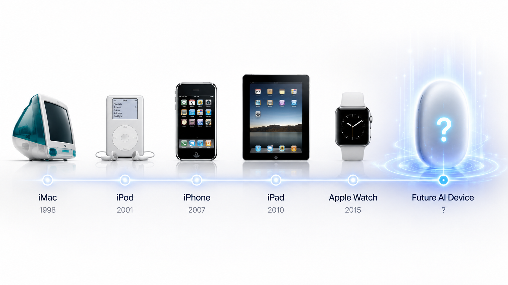
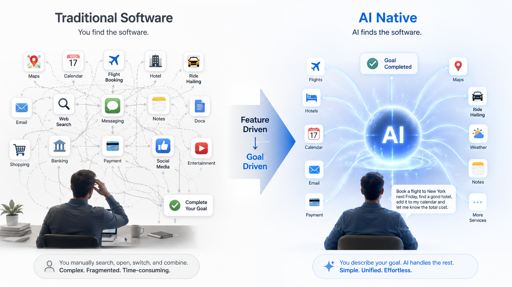
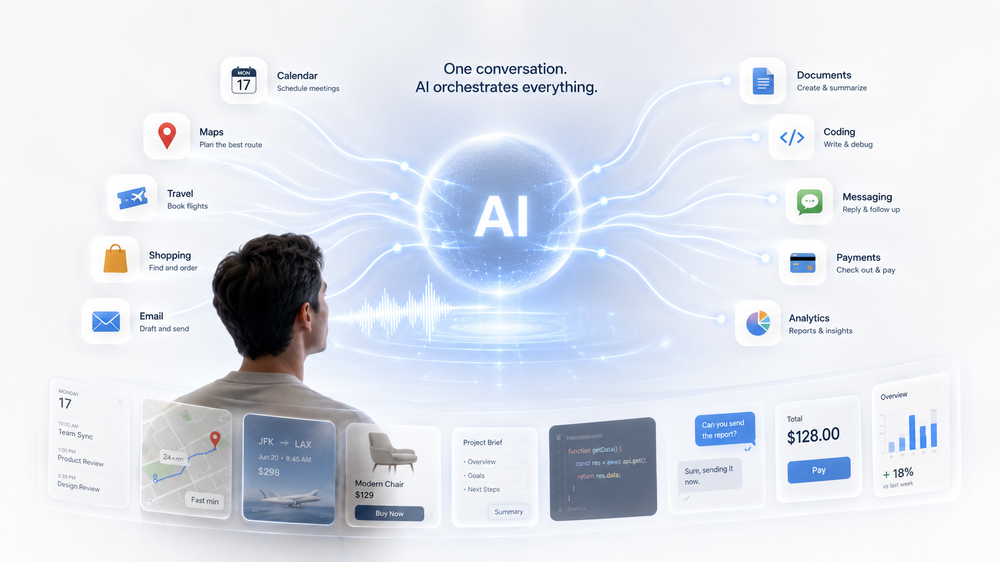

# 05 AI Native：为什么软件开始从「功能」走向「目标」？

> 从 OpenAI 的 AI 硬件计划，看下一代软件交互方式的变化。

> **注：** 本文中关于 OpenAI AI 硬件计划的观点，主要整理自 Sam Altman 与 Jony Ive 联合发布的公开信及官方公开视频，部分内容结合行业公开报道与作者分析。

---

## 前言

2025 年，OpenAI 宣布了一件震动整个科技行业的事情。

他们将与苹果前首席设计师 **Jony Ive** 共同打造下一代 AI 硬件。

消息一公布，几乎所有人的注意力都放在了同一个问题上：

- OpenAI 要做手机了吗？
- 它会不会取代 iPhone？
- 是不是只有一个聊天框？
- 会不会没有 App？

各种猜测铺天盖地。

但当我真正去看 OpenAI 官方发布的视频和公开信后，却发现了一件很有意思的事情。

**官方几乎没有介绍产品。**

没有产品外观。

没有系统界面。

没有参数配置。

甚至没有展示任何一个实际操作画面。

整整九分钟的视频，大部分时间都在讨论另一件事情：

> **今天的人机交互方式，是否已经到了需要重新思考的时候？**

这一点，远比一部新手机更值得关注。

因为 OpenAI 真正想重新设计的，也许并不是一台手机，而是人与软件沟通的方式。

---

## 为什么是 Jony Ive？

很多年轻开发者第一次听到 Jony Ive，可能只是知道：

> 「苹果传奇设计师」。

但如果回顾过去二十多年的消费电子历史，你会发现，他几乎参与了每一次重要的产品革命。

从 iMac 到 iPod。

从 iPhone 到 iPad。

再到 Apple Watch。

这些产品真正改变世界的，并不仅仅是性能。

而是交互方式。

例如 iPhone。

它最重要的创新，并不是手机变快了。

而是第一次让普通人几乎不用学习，就能够通过触摸屏完成操作。

它重新定义了人与计算机的沟通方式。

所以，当 OpenAI 选择与 Jony Ive 合作时，我第一反应并不是：

> OpenAI 要做一台更漂亮的手机。

而是：

> **OpenAI 想重新设计人与 AI 的交互。**

这是两个完全不同的问题。

---

## OpenAI 真正公布了什么？

有意思的是。

关于这款 AI 硬件，OpenAI 官方其实公布的信息非常有限。

没有产品图片。

没有发布日期。

没有硬件参数。

也没有展示任何操作界面。

官方更多讨论的是几个关键词：

- AI 已经拥有前所未有的能力；
- 今天的软件交互方式仍然停留在过去；
- 我们希望创造一种更加自然的人机交互体验。

注意。

这里始终没有出现一句：

> 我们要重新发明手机。

也没有说：

> 我们要做一台只有聊天界面的设备。

这些都是后来媒体和行业的猜测。

但这些猜测为什么会出现？

因为所有人都意识到了一件事情。

如果 AI 已经能够理解人类真正的需求。

那么今天的软件，是否还需要保持原来的样子？

这，才是 OpenAI 留给整个行业的问题。

---

## OpenAI 真正想重新思考什么？

很多人认为。

OpenAI 正在重新设计手机。

我并不完全认同。

因为如果只是设计一台手机。

OpenAI 根本没有必要投入如此大的资源。

更没有必要邀请 Jony Ive 加入。

他们真正想重新思考的，是一个更底层的问题：

> **软件为什么一定要长成今天这样？**

仔细想一想。

今天，当你想完成一件事情的时候。

第一步是什么？

例如：

晚上想吃火锅。

你的第一反应不是：

> 我想吃火锅。

而是：

> 打开美团。

或者：

> 打开大众点评。

准备一次旅行。

第一步也不是：

> 我想去东京。

而是：

> 打开订票软件。

> 打开酒店软件。

> 打开地图。

> 打开翻译软件。

不知道什么时候开始。

我们已经习惯了这样一种操作方式。

**不是先表达自己的目标。**

而是先寻找能够完成目标的软件。

换句话说。

今天的软件世界，有一个默认前提：

> **用户必须知道应该使用哪个 App。**

而这件事情，我们几乎从来没有怀疑过。

因为过去二十多年，软件一直都是这样工作的。

但是，AI 的出现，让这个前提第一次开始发生变化。

例如今天，你对 ChatGPT 说：

> 帮我规划一次东京五日游。

你不会告诉它：

先打开地图。

再查询酒店。

然后看看天气。

最后帮我整理成行程。

你只需要告诉它：

> 我要去东京旅行。

剩下的事情，AI 会尝试自己完成。

这里真正发生变化的，并不是聊天界面。

而是：

**用户第一次不需要主动寻找功能。**

用户只需要表达目标。

## 软件真正改变的，并不是界面

很多人在讨论 OpenAI 的 AI 硬件时，都会把注意力放在"聊天界面"上。

有人说：

未来是不是只有一个聊天框？

还有人说：

未来是不是再也没有 App 了？

但我认为，这些都只是表象。

真正发生变化的，并不是界面。

而是软件开始承担更多原本属于用户的工作。

举一个最简单的例子。

今天，当你准备一次旅行的时候，你需要自己完成很多决定。

例如：

- 我要用哪个 App 订机票？
- 我要去哪家酒店网站？
- 我要不要再查一下天气？
- 我要不要把行程同步到日历？
- 我要不要通知同行的人？

整个过程中，用户不仅需要表达自己的目标，还需要不断思考：

> **下一步应该使用哪个软件。**

但是，如果 AI 已经能够理解你的需求。

那么整个流程就可能变成：

> 「帮我安排一趟下周去东京五天的旅行。」

AI 会根据你的需求：

- 查询航班；
- 比较价格；
- 推荐酒店；
- 安排行程；
- 添加日历；
- 提醒出发时间。

用户不再需要关心：

到底使用了哪一个软件。

因为这些工作，都交给了 AI。

这里真正发生变化的是：

> **过去，寻找软件本身就是完成任务的一部分。**
>
> **未来，寻找软件开始成为 AI 的工作。**

这也是我认为 OpenAI 最想重新思考的地方。

---

## 为什么 OpenAI 一直没有展示产品？

回到 OpenAI 官方发布的视频。

直到今天，他们依然没有展示真正的产品。

有人觉得这是保密。

也有人认为产品还没有完成。

但我更愿意从另一个角度理解。

因为对于 OpenAI 来说，真正重要的从来不是手机长什么样。

而是：

> **AI 应该如何成为人与计算机之间新的交互层。**

如果这个问题没有解决。

即使做出一台配置再高、外观再漂亮的手机，也只是另一台智能手机。

真正困难的，不是设计一块屏幕。

而是重新设计人与软件之间的关系。

过去二十多年，我们已经形成了一种固定的使用习惯：

有需求。

↓

找到对应 App。

↓

打开 App。

↓

寻找功能。

↓

完成任务。

这几乎成为所有软件默认的设计方式。

而 OpenAI 想挑战的，正是这个默认前提。

如果 AI 已经能够理解目标、规划任务、调用工具。

那么：

> **用户为什么还需要知道应该打开哪个 App？**

这个问题，也许比产品本身更加重要。

---

## OpenAI 并不是唯一这样思考

事实上，这种变化已经开始出现在越来越多的产品中。

例如国内已经出现了一些 AI 手机方案。

它们开始尝试让 AI 帮助用户操作 App，完成订餐、打车、发送消息等任务。

虽然目前还处于探索阶段，但它至少说明了一件事情：

**整个行业都开始意识到，AI 不应该只是一个聊天机器人。**

它更应该成为软件的新入口。

OpenAI 的探索。

国内 AI 手机的尝试。

以及越来越多 AI Agent 产品的出现。

这些产品路线并不完全相同。

但它们正在朝着同一个方向演进：

**让用户越来越少关心软件本身，而越来越关注自己的目标。**

---

## 为什么这意味着软件开始从「功能」走向「目标」？

在第二篇文章中，我们已经讨论过：

AI Native 与传统软件最大的区别，是开始围绕目标，而不是功能设计。

而 OpenAI 的 AI 硬件，则让这个理念第一次开始影响软件产品本身。

过去的软件，会不断增加新的按钮、新的菜单、新的页面。

因为软件只能提供功能。

真正完成任务的人，始终是用户。

而 AI Native 软件开始承担更多职责。

理解目标。

规划任务。

调用工具。

完成执行。

用户真正需要做的事情越来越少。

软件真正需要完成的事情越来越多。

所以，OpenAI 想重新设计的，并不是一部手机。

而是：

> **人与软件沟通的方式。**

这也是为什么官方在发布会上，并没有花太多时间介绍产品参数。

因为参数决定的是一款产品。

而交互方式，决定的是一个时代。

---

## 写在最后

回顾过去几十年的软件发展。

命令行时代，我们学习命令。

图形界面时代，我们学习按钮。

智能手机时代，我们学习 App。

几乎每一次软件革命，都要求用户重新学习如何使用计算机。

而 AI Native，也许第一次开始走向另一个方向。

不是让用户继续学习软件。

而是让软件开始学习用户。

OpenAI 的 AI 硬件最终会是什么样子，我们今天还不知道。

它也许仍然会有屏幕。

也许仍然会有 App。

甚至可能和今天所有人的猜测都不同。

但它已经提出了一个值得整个软件行业思考的问题：

> **如果 AI 已经能够理解用户真正想完成什么，那么未来的软件，还需要让用户自己寻找功能吗？**

我想，这或许就是 AI Native 真正带来的变化。

软件发展的方向，不再是不断增加新的功能。

而是不断减少用户为了完成目标所需要付出的思考和操作。

**当软件开始理解目标，而不是等待用户寻找功能的时候。**

**软件，也真正开始从「功能」走向了「目标」。**

---

## 延伸阅读

如果你对本文讨论的话题感兴趣，推荐阅读以下公开资料：

### OpenAI 官方资料

- OpenAI：Sam Altman & Jony Ive AI Hardware Announcement（公开信）

- OpenAI 官方视频：Sam Altman × Jony Ive 对谈（AI Hardware）

### 行业报道

- 爱范儿：《OpenAI 新设备曝光：没有屏幕，没有 App，AI 硬件时代来了？》

- 极客公园、The Verge、Bloomberg 等关于 OpenAI AI Hardware 的公开报道

---

> **声明：**

>

> 本文重点讨论 AI Native 软件设计的发展趋势。

>

> 关于 OpenAI AI 硬件的具体产品形态，目前官方尚未公布。文中涉及未来交互方式的内容，属于基于公开资料的分析与思考，并不代表 OpenAI 已经公布的产品设计。