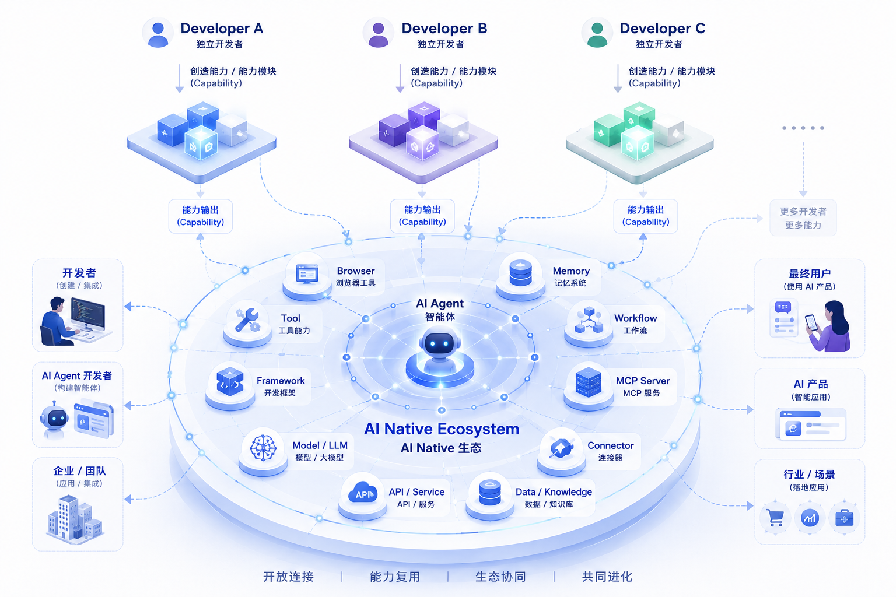
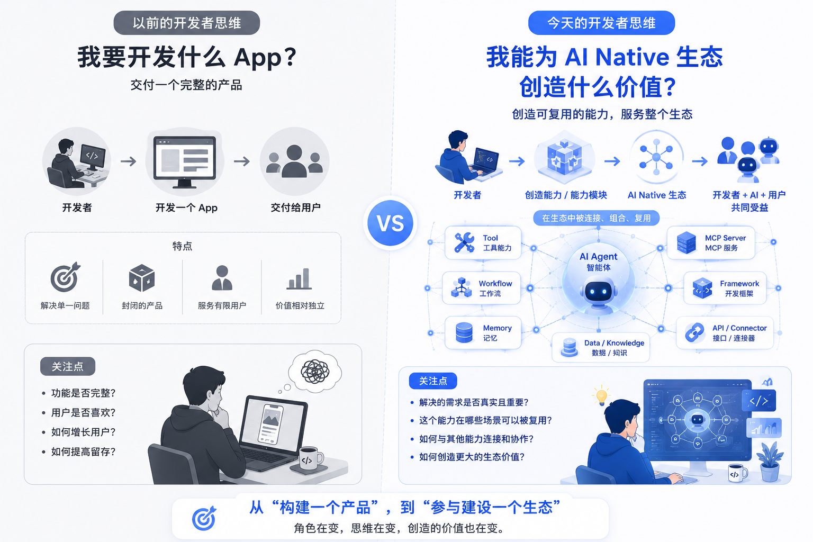
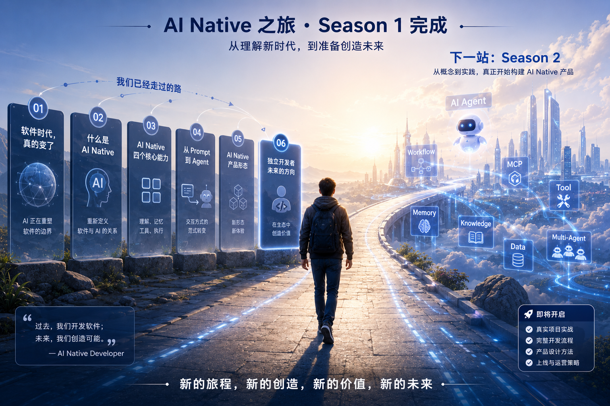

# 06 AI Native：独立开发者未来的发展方向

> 从开发一个 App，到思考自己在 AI Native 生态中的价值。

---

过去，独立开发者思考的是：我要开发什么 App？

今天，一个新的问题开始出现：我要在 AI Native 生态中创造什么价值？

---

## 前言

上一篇文章，我们讨论了 OpenAI 为什么正在重新定义下一代计算平台。

如果还没有阅读，建议先阅读上一篇，因为本文不会再重复解释 GPT、Operator、Deep Research、MCP 等概念，而是继续讨论一个新的问题。

当 AI Native 平台逐渐形成之后，独立开发者应该如何选择自己的未来？

过去十几年，独立开发者的目标其实很明确。

做一个网站。

做一个 App。

或者做一个 SaaS 产品。

软件，就是最终交付物。

但最近一年，当我持续观察 AI Native 产品的发展时，我发现一个越来越明显的变化。

很多优秀的开发者，开始不再执着于开发一个完整的 App。

他们创造的东西，正在发生变化。

下面三个案例，或许能够说明这一点。

---

## 案例一：Simon Willison —— 持续创造可以复用的 AI 能力

如果你关注 AI 开发领域，应该听过 Simon Willison。

他不是一家明星 AI 公司的创始人，也没有融资神话。

更多时候，他是一位持续分享、持续实验、持续开源的独立开发者。

过去几年，他不断发布关于 LLM、Embedding、Prompt Engineering、本地模型、MCP 等方向的实践和工具。

如果仔细观察他的项目，会发现一个有趣的变化。

早期，我们更容易看到一个完整的软件。

而现在，他越来越多的工作，是围绕 AI 构建各种可以复用的能力。

有的是一个命令行工具。

有的是一个小型开源项目。

有的是一套实践方法。

这些项目单独来看，都不是传统意义上的 App。

但它们却不断被其他开发者引用、组合，并最终进入更多 AI 产品。

Simon 并没有停止开发软件。

只是他开发的软件，越来越不像传统软件。

这个案例告诉我们什么？

过去，独立开发者更多思考的是：

> 我要开发一个产品。

而现在，越来越多开发者开始思考：

> 我能不能先创造一种能力，再让更多产品使用它？

这是 AI Native 带来的一个重要变化。

---

## 案例二：Browser Use —— 一个能力，也可以成为产品

去年，Browser Use 在 AI 社区迅速流行起来。

它做的事情其实很简单：

> 让 AI 能够像人一样操作浏览器。

它没有重新开发浏览器。

也没有重新开发聊天机器人。

作者只专注解决一个问题：

> 如何让 AI 真正使用网页。

这个能力出现之后，很快被越来越多 Agent 项目集成。

对于最终用户来说，他们未必知道 Browser Use 的存在。

但很多 AI 产品，都已经开始依赖它完成浏览器操作。

换句话说，它没有成为最终产品。

却成为越来越多产品背后的能力。

这也是 AI Native 产品一个非常典型的特点。

它创造的价值，并不一定直接面对用户。

也可以服务于 AI 本身。

这个案例告诉我们什么？

移动互联网时代，我们习惯把软件理解为一个 App。

而 Browser Use 告诉我们：

> 有时候，一个能力本身，就可以成为一个优秀的产品。

---

## 案例三：FastMCP —— AI Native 生态，同样需要基础设施

随着 MCP 的发展，越来越多开发者开始开发自己的 MCP Server。

很多人选择直接开发具体能力。

而 FastMCP 的作者，却选择了另一条路线。

他没有开发一个 Agent。

也没有开发一个聊天产品。

而是开发了一套帮助开发者快速构建 MCP Server 的框架。

对于普通用户来说，它几乎没有存在感。

但对于开发者来说，它极大降低了 MCP Server 的开发成本。

今天，越来越多 MCP 项目都建立在 FastMCP 之上。

这和很多传统开源框架一样。

它不是终端产品。

却成为整个生态的重要基础设施。

这个案例告诉我们什么？

AI Native 不仅会催生新的产品。

也会催生新的开发工具、新的框架，以及新的基础设施。

对于独立开发者来说，这同样是一条值得关注的发展方向。

---

## 三个案例，一个共同变化

Simon Willison。

Browser Use。

FastMCP。

它们看起来完全不同。

一个在持续做 AI 工具。

一个专注浏览器能力。

一个专注开发框架。

但如果站在 AI Native 的角度观察，就会发现它们拥有一个共同特点。

他们并没有停止开发软件。

只是开始重新思考：

> 什么样的软件，更适合 AI Native 时代？

过去，他们更关注最终产品。

今天，他们开始关注生态。

过去，他们开发一个完整的软件。

今天，他们创造一种可以不断被复用的能力。

这里并没有标准答案。

未来也一定会出现更多新的产品形态。

但至少在今天，我们已经能够看到一个越来越清晰的趋势：

独立开发者创造的对象，正在变得越来越丰富。

而这，也正是 AI Native 带来的新变化。

---

## AI Native Developer：一种新的开发者思维

看到这里，你可能会发现，这三个案例其实没有太多共同点。

Simon Willison 持续构建 LLM 工具和实践。

Browser Use 专注于浏览器能力。

FastMCP 则帮助开发者快速构建 MCP Server。

他们面对不同的用户，解决不同的问题，也采用不同的商业模式。

但如果站在 AI Native 的角度观察，他们却有着相同的思考方式。

他们不再首先思考：

> 我要开发什么 App？

而是开始思考：

> AI Native 生态需要什么？

这也是我想表达的一个观点。

AI Native 并没有创造一种新的开发者职业，而是在形成一种新的开发者思维。

我更愿意把这种思维称为：

> AI Native Developer。

这里的 AI Native Developer，并不是一个新的职位名称。

它更像是一种产品思维。

过去，一个优秀的独立开发者，会不断思考如何做出一个更好的产品。

今天，一个优秀的 AI Native Developer，还会继续思考另外一个问题：

> 我的产品，在整个 AI Native 生态中承担什么角色？

这个角色，可以是一款完整的产品。

也可以是一项能力。

一个工具。

一个框架。

甚至一个连接现实世界的接口。

重点已经不再是产品形态，而是它能够创造什么价值。

---

## 独立开发者，未来应该如何选择方向？

很多开发者问我：

> AI Native 时代，到底应该做什么产品？

我觉得，这个问题本身就很难有统一答案。

因为 AI Native 仍然处于快速发展阶段。

今天流行的产品形态，几年后可能就会发生变化。

真正值得关注的，不是具体做什么，而是如何思考。

如果今天让我重新开始做一个 AI 产品，我不会急着打开编辑器。

我会先回答三个问题。

### 第一，这是谁的问题？

不要先想模型。

不要先想技术。

先想：

> 到底是谁，在遇到什么问题？

AI Native 从来不是为了使用 AI。

而是为了完成目标。

如果没有真实需求，再先进的模型，也很难做出真正有价值的产品。

---

### 第二，这个价值应该放在哪一层？

过去，我们默认答案就是：

> 做一个 App。

今天，这个答案开始变得更多元。

有些问题，适合做完整产品。

有些问题，适合做一个 Tool。

有些问题，适合做 Workflow。

有些问题，适合做开发框架。

也有些问题，更适合作为 AI 可以调用的一项能力。

这也是前三个案例最大的启发。

他们并没有选择同一种产品形态。

而是选择了最适合解决问题的位置。

---

### 第三，它能否进入 AI Native 生态？

这是我认为过去很少有人思考的问题。

移动互联网时代，一个产品做好自己就足够了。

而 AI Native 时代，一个产品还需要思考：

它是否能够与其他能力协作？

是否能够被更多开发者复用？

是否能够成为整个生态的一部分？

这并不是要求每个产品都做平台。

而是提醒我们：

未来的软件，很可能越来越强调连接、组合和协作。

---

## AI Native，并没有减少机会

每一次技术革命，都会有人担心机会越来越少。

PC 时代如此。

互联网时代如此。

移动互联网时代也是如此。

AI Native 也一样。

但回过头来看，每一次革命真正减少的，都不是机会。

而是旧的方法。

新的平台出现以后，新的产品、新的工具、新的基础设施、新的服务都会不断出现。

独立开发者能够参与的方式，也会越来越丰富。

有人继续做完整产品。

有人专注开发工具。

有人深耕行业能力。

有人构建底层框架。

没有哪一种方向一定更好。

真正重要的是：

> 找到自己能够持续创造价值的位置。

---

## 写在最后

从第一篇开始，我们一直在讨论一个问题：

什么是 AI Native？

现在，Season 1 可以给出一个阶段性的答案。

AI Native，并不仅仅意味着软件开始拥有理解、记忆、工具和执行能力。

它更意味着：

软件开始拥有新的产品形态。

平台开始形成新的生态。

开发者，也开始拥有新的创造空间。

过去，独立开发者最关心的问题是：

> 我要开发什么 App？

今天，我认为更值得思考的问题是：

> 我能为 AI Native 生态创造什么价值？

也许是一款完整的产品。

也许是一项可以被不断复用的能力。

也许是一个工具。

也许是一套框架。

未来还会出现什么新的形态，没有人能够准确预测。

但至少今天，我们已经能够看到一个越来越清晰的方向。

AI Native 并没有重新定义开发者这个职业。

它正在重新定义开发者创造价值的方式。

而这，或许就是 AI Native 时代，留给每一位独立开发者最大的机会。

---
