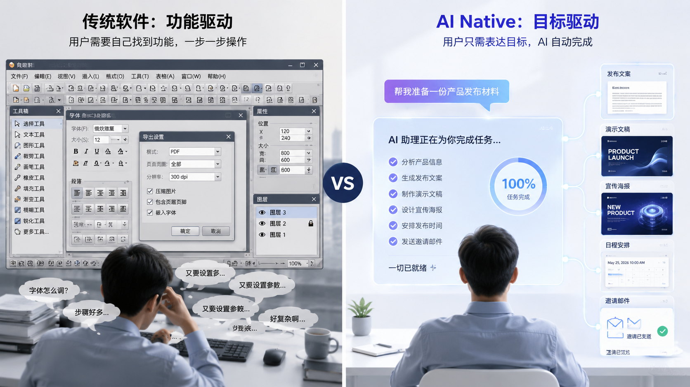
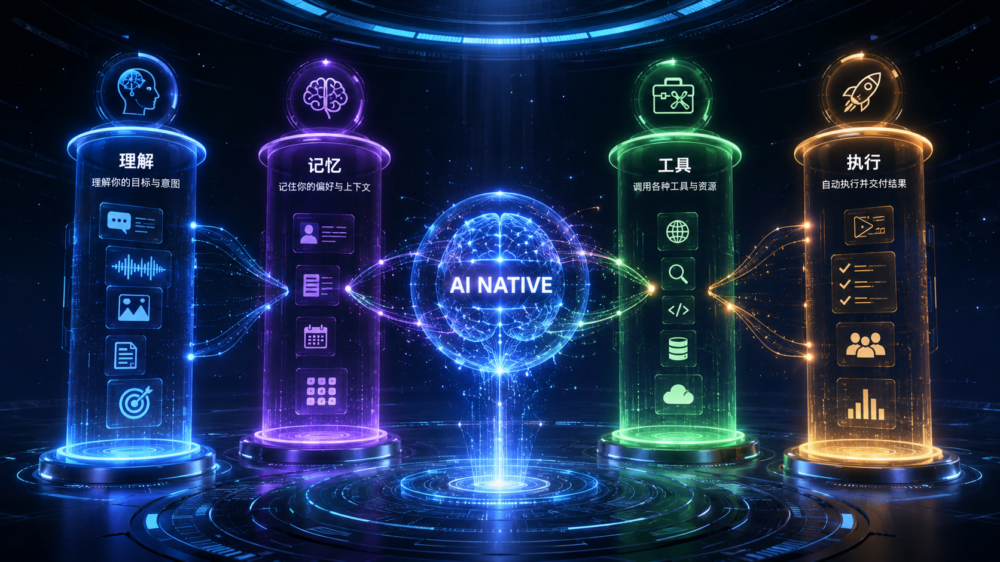
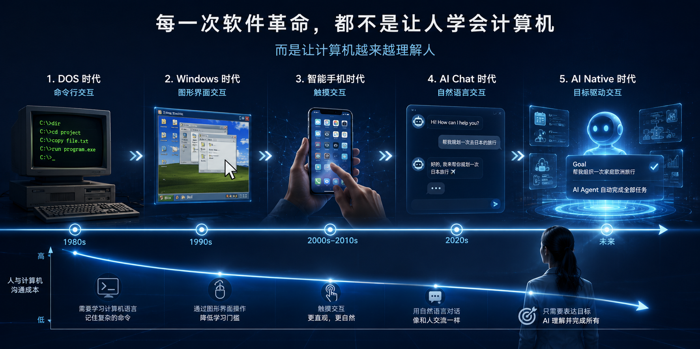
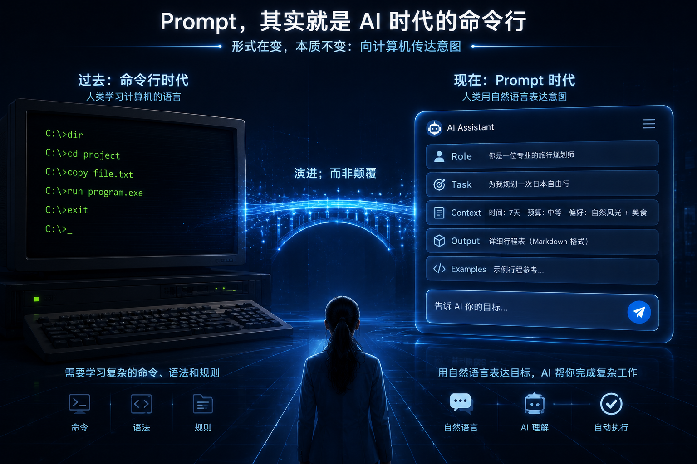
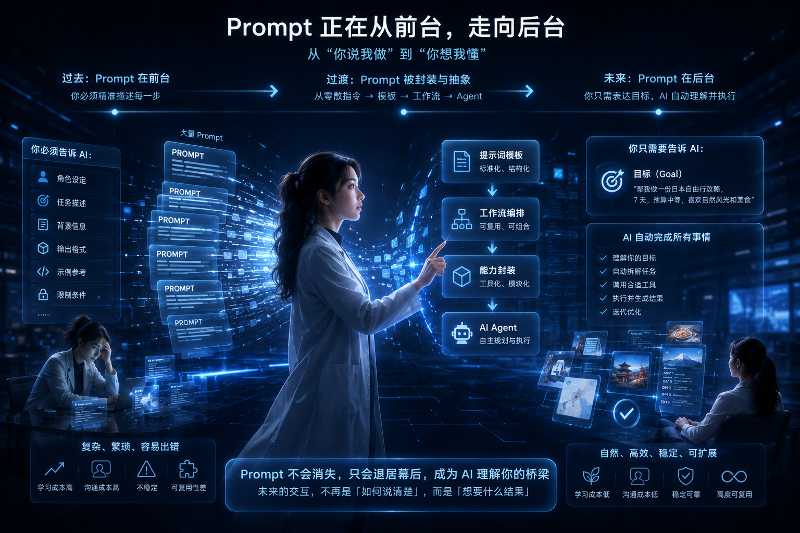
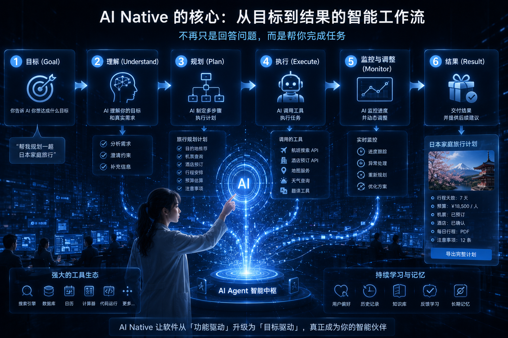

# 03 AI Native：真正的 AI Native 产品长什么样？

> **判断标准：理解、记忆、工具、执行。**
>
> **交互方向：Prompt 退居幕后，用户只表达目标。**

---


02 的结论：范式变化的标志，是**责任从用户转向软件**。

接下来两个实操问题：

1. 怎么判断一个产品是不是真 AI Native？
2. 真 AI Native 里，用户还要不要学 Prompt？

这篇不讨论概念名称。

我们只看产品形态：用户看到什么，系统在后台做什么。

---

# 上半：怎么判断真假 AI Native

## 一、App + GPT ≠ AI Native



很多「AI Native」产品只是：接了 GPT API、加了聊天框、做了 Prompt 模板。

架构没变——用户仍在功能驱动的 App 里，AI 是插件。

典型形态是：

```text
原来的 App
  ├── 原来的菜单
  ├── 原来的页面
  ├── 原来的流程
  └── 新增一个 AI 聊天框
```

用户真正要完成任务时，还是要自己知道：

- 应该在哪个页面开始；
- 哪些信息要先准备；
- AI 生成的内容要贴到哪里；
- 后续流程还要怎么走。

这不是 AI Native，只是**AI 功能被塞进旧产品**。

真 AI Native：**AI 是中心**，Memory、Tools、Browser、Code 等围绕它调度，而不是用户逐个打开。

它更像这样：

```text
用户目标
  ↓
AI 理解目标
  ↓
读取上下文 / 记忆
  ↓
调用工具
  ↓
执行流程
  ↓
返回结果
```

> **App + GPT 是旧框架加能力；AI Native 是用 AI 重新组织产品。**

下面四能力，用来检验「有没有重新组织」。

---

## 二、四能力：理解 · 记忆 · 工具 · 执行

### 理解——听懂目标，不是听懂命令

「导出 PDF」是命令；「做一个适合老板看的版本」是目标——背后有场景、对象、语气、篇幅。

真正的产品差异在这里：

```text
用户输入：帮我做一个适合老板看的版本
  ↓
AI 判断：老板要看结论，不要看过程
  ↓
AI 调整：压缩背景、突出风险、补充下一步建议
  ↓
输出：更适合汇报的版本
```

如果 AI 只是把这句话当成「改写得正式一点」，它只是文本助手。

如果它能理解对象、场景、目标和约束，它才开始接近 AI Native。

没有理解，后面全是瞎执行。

### 记忆——连续性，不是每次从零开始


要知道你是谁、项目进展、风格偏好、上次做到哪。ChatGPT 自定义指令、Cursor 对代码库的理解，都是记忆。

以 Cursor 为例。

你不是每次都从空白聊天框开始解释：

- 这是一个 React 项目；
- 这里用的是哪套路由；
- 代码风格是什么；
- 上一次改到哪里；
- 哪些文件和这个 Bug 相关。

Cursor 的价值不只是模型会写代码，而是它能把**当前文件、相关文件、项目结构、终端输出、历史修改**放进同一个上下文里。

这就是为什么它更像开发搭档，而不是一个代码问答机器人。

没有记忆，AI 每次都要重新认识你。它可以聪明，但不连续。

### 工具——能干活，不只是能聊天


搜索、查库、调 API、操作浏览器、写代码、发邮件——聊天是入口，**工具调用才是价值起点**。MCP、Browser Use 等越来越重要，原因在这里。

可以用一个简单判断：

> AI 的回答能不能进入真实工作流？

如果它只能告诉你“应该怎么做”，它还是顾问。

如果它能调用浏览器打开网页、查询数据库、写入文档、修改代码、创建日程，它才开始变成执行系统。

MCP、Browser Use、插件系统的价值，不是让 AI 更会聊天，而是让 AI 能连接真实世界里的能力。

### 执行——串流程，不是等点击

你说「帮我准备产品发布」——搜集资料、写文案、做海报、排会议、发邮件、查清单，**多步串成一事**。重点不是单点功能强，而是推到结果。

这里的关键不是“自动化”三个字。

关键是 AI 能不能管理一个流程：

```text
确认发布目标
  ↓
整理核心卖点
  ↓
生成发布文案
  ↓
生成配图需求
  ↓
安排发布时间
  ↓
生成检查清单
  ↓
提醒用户确认
```

真正的执行不是“一键完成所有事”，而是**在可控范围内推进任务，并在关键节点让用户确认**。

---

## 三、四能力组合 + 四问判断



单独一项都不够。组合起来才是 AI Native：

> **理解 → 记忆 → 工具 → 执行 → 结果**

| # | Yes/No 问题 | 四个 No → 多半是 |
|---|-------------|------------------|
| 1 | 能否理解**真实目标**？ | 传统 App + 聊天框 |
| 2 | 能否**记住**上下文？ | 无连续性助手 |
| 3 | 能否**调用**外部工具？ | 纯聊天机器人 |
| 4 | 能否**主动完成**多步流程？ | 单点功能助手 |


---

# 下半：用户还要学 Prompt 吗

四能力到位的产品，交互上会呈现同一个趋势：**用户越来越只表达目标，Prompt 越来越退到后台。**

## 四、Prompt 为什么会火，以及为什么不是终点


2023 年前后，Prompt 是几乎唯一的沟通方式——堆角色、格式、字数，输出才够用。**Prompt Engineering 是必经阶段，不是终点。**

越优秀的产品，越不强调 Prompt。Cursor、Perplexity 用户往往只说一句话：**帮我完成这个任务。**

> **Prompt 很重要，但 Prompt 不是未来。**

这里要区分两件事：

- Prompt 作为系统能力，会长期存在；
- 用户每天手写复杂 Prompt，不会是最终形态。

就像命令行今天仍然存在，但普通用户不会每天用命令行打开文件。

---

## 五、Prompt = AI 时代的命令行



软件史有一条线：**降低沟通成本，把中间语言藏起来。**

| 时代 | 用户学什么 | 被隐藏什么 |
|------|------------|------------|
| 命令行 | `cd`、`cp` | — |
| 图形界面 | 点击、拖拽 | 命令 |
| 智能手机 | 手势 | 菜单、文件系统 |
| 大模型早期 | Prompt 技巧 | — |
| AI Native | **自然语言目标** | **Prompt** |



Prompt 与命令行同是**中间语言**——重要，但不是最终形态。Windows 没要求人人学 DOS；AI Native 也不会要求人人做 Prompt 专家。

> **未来最会写 Prompt 的，是 AI，不是人。**

---

## 六、三个产品：前台一句，后台多段 Prompt



### Cursor：用户说任务，系统组织代码上下文

前台：

> 修复这个 Bug。

后台：

```text
读取当前文件
  ↓
找到相关调用
  ↓
结合终端错误
  ↓
判断可能原因
  ↓
生成修改方案
  ↓
应用代码改动
```

你看到的是一句自然语言。

Cursor 做的是一组上下文选择、Prompt 组织和工具调用。

### Perplexity：用户问问题，系统完成搜索和引用组织

前台：

> 帮我分析一下 AI Native 的趋势。

后台：

```text
理解问题
  ↓
拆成搜索子问题
  ↓
检索网页
  ↓
筛选可信来源
  ↓
提取关键段落
  ↓
生成带引用的回答
```

这已经不是传统搜索框，也不是普通聊天框。

它把“搜索、阅读、整理、引用”封装成一个结果。

### NotebookLM：用户问资料，系统组织文档上下文

前台：

> 总结这批资料里关于产品机会的内容。

后台：

```text
读取上传资料
  ↓
建立文档索引
  ↓
找到相关片段
  ↓
比较不同文档观点
  ↓
生成总结
  ↓
保留资料来源
```

真正工作的，不是用户那一句 Prompt，而是系统对资料、上下文和引用关系的组织。

> **越优秀的产品，后台 Prompt 越复杂，前台输入越简单。**



AI Native 的设计重心：**用户只表达目标；系统在内部完成理解 → 生成 Prompt → 调工具 → 执行 → 检查。** Prompt 从前台能力，变成内部能力。

---

## 写在最后

03 回答两个问题：

> **真 AI Native：理解 + 记忆 + 工具 + 执行。**
>
> **真交互：用户说目标，系统在后台写 Prompt。**


下一篇进入更宏观的一层：**当用户只表达目标，软件入口本身会发生什么变化？独立开发者又该站在哪？**

---

## 下一篇

**04 AI Native：新入口、新生态与独立开发者**

App 入口 → AI 调度；从「做什么 App」到「在生态里创造什么价值」。Season 1 收官。
