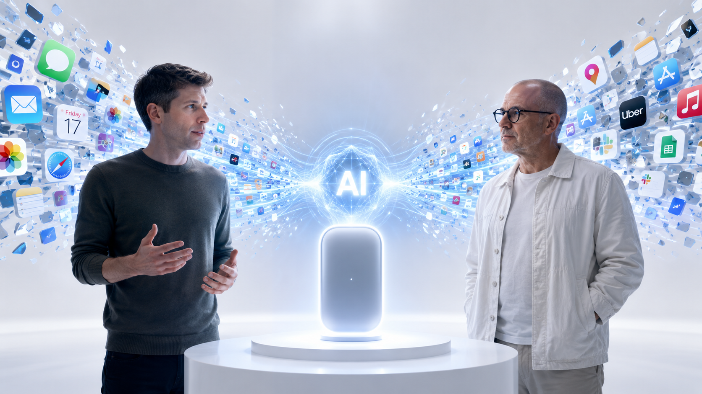
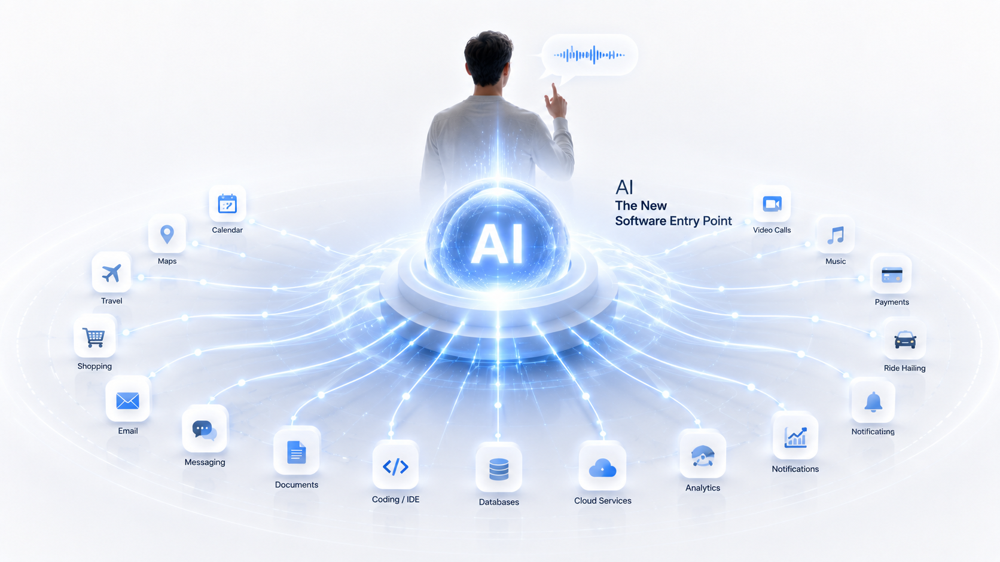
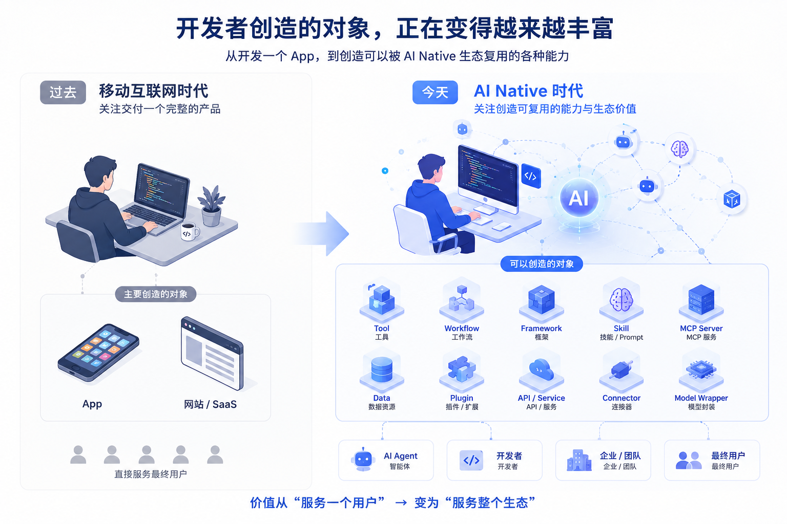

# 04 AI Native：新入口、新生态与独立开发者

> **入口变了：用户先表达目标，AI 调度软件。**
>
> **机会变了：开发者先问生态位置，再问产品形态。**

> **注：** 关于 OpenAI AI 硬件计划的观点，整理自 Sam Altman 与 Jony Ive 公开信及官方视频，部分内容结合行业公开报道与作者分析。

---



## 本篇范围

- **只讲：** 软件入口从 App 到 AI 调度；对产品设计者的影响；独立开发者在生态中的位置与方向；Season 1 收束。
- **不重复：** 01～03 的范式、四能力、Prompt——本篇谈**入口、生态、落地**。
- **本篇结构：** 上半——行业入口变化；下半——开发者怎么办 + 全季回顾。

## 承接

03 讲清楚了：真 AI Native 有四能力，用户只需表达目标，Prompt 在后台。

还有一个问题：

> **用户打开设备，第一个动作还会是「找 App」吗？**

以及，**你作为开发者，该做什么？**

这篇把 Season 1 收到现实层面：

- 对用户来说，入口可能从 App 变成 AI；
- 对开发者来说，机会可能从“做一个 App”扩展到“成为 AI 能调用的能力”。

---

# 上半：入口从 App 到 AI

## 一、OpenAI × Jony Ive 在讨论什么？


2025 年 OpenAI 与 **Jony Ive** 合作 AI 硬件。舆论问：要做 iPhone 杀手吗？

官方九分钟视频里**几乎没有产品展示**——在问：

> **今天的人机交互，是否到了必须重新思考的时候？**

Jony Ive 参与的产品改变世界的，往往是**交互入口**（iPhone 让触摸替代学习成本）。OpenAI 找的，更像是**人与 AI 的新入口**，不是「更漂亮的手机」。

这件事值得关注，不是因为 OpenAI 一定会做出某个爆款设备。

而是它提出了一个软件行业必须面对的问题：

> 当 AI 已经能理解目标、记住上下文、调用工具时，用户还需要先打开一个个 App 吗？

---

## 二、东京旅行：找 App 曾是用户的工作


规划东京五日游，移动时代的路径：

订票 App → 酒店 App → 地图 → 翻译 → 天气 → **自己拼行程**。

「找软件、切换软件」**本身就是任务的一部分**——因为入口是 App，用户必须知道打开哪个。

对 AI 说「帮我规划东京五日游」——你表达目标，AI 调度工具。**用户第一次可以不再主动找软件。**

如果把这个过程展开，变化会更明显。

传统路径：

```text
我想去东京
  ↓
我自己判断要查机票
  ↓
我打开订票 App
  ↓
我自己判断要查酒店
  ↓
我打开酒店 App
  ↓
我自己判断位置是否方便
  ↓
我打开地图
  ↓
我把所有信息整理成行程
```

AI 入口路径：

```text
我想去东京五天，预算一万元，偏轻松
  ↓
AI 拆解任务：航班 / 酒店 / 景点 / 交通 / 天气 / 日历
  ↓
AI 调用工具和服务
  ↓
AI 给出可调整的行程草案
  ↓
用户确认或修改偏好
```

界面看起来可能只是一个输入框。

但背后变化是：**拆任务、找工具、排顺序、组合结果，这些工作从用户转到了 AI。**

| 过去 | 未来 |
|------|------|
| App 是入口 | AI 可能是入口 |
| 用户找 App → 用功能 | 用户表达目标 → AI 调度服务 |

> **过去，寻找软件是完成任务的一部分。**
>
> **未来，寻找软件是 AI 的工作。**

---

## 三、变的不是界面，是调度归谁管

界面讨论（只有聊天框？没有 App？）不如分工重要。

AI 具备四能力后，「下一步用哪个软件」从**用户大脑**变成**AI 调度**——查航班、比酒店、排行程、加日历，用户不必关心具体 App。

OpenAI 迟迟不展示产品，一种理解是：**入口层没想清，做硬件也只是多一台设备。** 它在挑战的习惯是：

```text
有需求 → 找 App → 找功能 → 完成任务
```

Agent、AI 手机、桌面助手——路线不同，方向相同：**少关心用哪个软件，多关心完成什么目标。**

---

## 四、对产品设计者的四个影响



### 1. 不只争用户点击，还要争「AI 能否调用我」

过去产品最关心：用户会不会打开我的 App。

未来还要关心：AI 能不能发现我、理解我、调用我。

如果你的能力只能藏在界面按钮里，AI 很难调度。

### 2. 功能不只给人用，也要给 AI 调用

过去功能面向人，所以重点是页面、按钮、流程。

未来功能也面向 AI，所以还要有：

- API；
- 结构化输入输出；
- 权限边界；
- 错误返回；
- 可审计记录。

### 3. 产品边界会更开放

过去一个 App 想把用户留在自己里面。

未来一个能力可能被很多 Agent、Workflow 和平台复用。

产品价值不一定只发生在自己的界面里，也可能发生在别人的流程里。

### 4. 竞争不只在 App 之间

未来竞争会出现在更多层：

- 谁的数据更容易被 AI 理解；
- 谁的接口更稳定；
- 谁的能力更容易组合；
- 谁在生态中的位置更关键。


> **如果 AI 能理解用户想完成什么，入口还一定是 App 吗？**

---

# 下半：独立开发者站在哪一层

## 五、两个问题，两种思维



过去：

> **我要开发什么 App？**

今天：

> **我要在 AI Native 生态里创造什么价值？**

价值可以是一款 App，也可以是一项**被 AI 调用、被开发者复用的能力**——取决于生态位置。

---

## 六、三个案例：三种位置

**Simon Willison** — 可复用实践和工具

Simon 的很多工作不是传统意义上的 App。

它可能是一个 CLI 工具、一篇实验记录、一个开源库、一套关于 LLM / Embedding / MCP 的实践方法。

这些东西不一定直接面对普通用户，但会被开发者引用、改造、组合进自己的产品里。

他的价值不是“做了一个大而全的软件”，而是持续产出**可复用的 AI 能力和知识组件**。

> **启发：独立开发者不一定先做完整产品，也可以先做生态里会被反复使用的小能力。**

**Browser Use** — 能力本身成为产品

Browser Use 解决的是一个非常具体的问题：

> 如何让 AI 像人一样操作浏览器？

它不需要自己成为最终用户每天打开的 App。

只要越来越多 Agent 产品需要浏览器操作，它就可能成为这些产品背后的能力层。

最终用户未必知道 Browser Use，但它参与了任务完成。

> **启发：AI Native 时代，面向 AI 的能力也可以成为产品。**

**FastMCP** — 基础设施位置

FastMCP 也不是一个面向普通用户的 App。

它服务的是开发者：帮开发者更快构建 MCP Server。

如果越来越多工具需要通过 MCP 接入 AI，那构建 MCP Server 的框架就会变成生态基础设施。

它离用户很远，但离生态很近。

> **启发：越多产品进入 AI Native，越需要新的开发框架、协议工具和基础设施。**


共同规律：

> **先问价值在生态哪一层、能否被复用与调用，再问产品形态。**

---

## 七、四个方向 + 三个自检


| 方向 | 做什么 | 例子 |
|------|--------|------|
| 完整产品 | 直面用户 | AI 写作、法律、教育 |
| 可复用能力 | 被 AI / 产品调用 | 浏览器操作、文档解析 |
| 开发工具 | 让 AI 产品更好做 | Agent 编排、MCP 框架 |
| 基础设施 | 稳定底层 | 模型路由、向量库、权限 |

动手前三问：

1. **这是谁的问题？**（不从模型出发）
2. **价值该放哪一层？**（形态服从问题）
3. **能否进入生态循环？**（可组合、可调用、可复用）

> **机会没有变少，变的是方法。先问生态位置，再问产品形态。**

可以把这三个问题落成一个简单判断：

```text
如果用户愿意直接为结果付费 → 做完整产品
如果很多产品都会需要这项能力 → 做可复用能力
如果开发者反复遇到同一类麻烦 → 做开发工具
如果生态运行离不开它 → 做基础设施
```

这不是让每个人都放弃做 App。

而是提醒独立开发者：**App 只是其中一种形态，不是唯一答案。**

---

## Season 1 收束


| 篇 | 一句话 |
|----|--------|
| **01** | 过去是人学习软件，未来是软件学习人。 |
| **02** | 基本单位从功能变成目标，责任从用户转向系统。 |
| **03** | 四能力验真伪；Prompt 是命令行，退居幕后。 |
| **04** | 入口变成 AI 调度；开发者在生态里找位置。 |

Season 1 到此结束。Season 2 进入产品层：记忆、工具、Agent 工作流，以及真实产品的构建与验证。

---

## 延伸阅读

- OpenAI：Sam Altman & Jony Ive AI Hardware Announcement（公开信）
- OpenAI 官方视频：Sam Altman × Jony Ive 对谈
- 爱范儿、极客公园、The Verge 等关于 OpenAI AI Hardware 的公开报道

---

> **声明：** OpenAI AI 硬件具体形态官方尚未公布；文中关于未来交互的分析，基于公开资料与作者思考，不代表 OpenAI 已公布的产品设计。

---

## 下一季预告

**Season 2（规划中）：AI Native 产品层**
